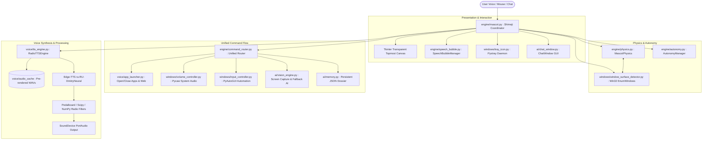

# 🤖 AGENTS.md — Master Architecture & Developer Manual for AI Agents

> **Audience**: Autonomous AI Coding Agents (Claude, GPT, Gemini, DeepSeek, Cursor, Hermes, Copilot, etc.)  
> **Repository**: `bocchi-shimeji-con-ia-local-y-api` (Alastor Voice AI Shimeji Companion)  
> **Target OS**: Windows 10 / Windows 11 (x64)  
> **Language & Runtime**: Python 3.10+ / PyInstaller Portable Standalone Executable  

---

## 🧭 1. Executive Summary & Purpose

This repository implements **Alastor (The Radio Demon)** from *Hazbin Hotel* as an intelligent desktop companion for Windows.
Unlike standard static Shimeji desktop mascots, this system combines:
1. **Interactive Physics Mascot**: Transparent, borderless Tkinter window that renders animated sprites, adheres to gravity, climbs screen borders, and dynamically walks across the tops/tabs of real Windows application windows.
2. **1930s Radio Voice & DSP**: Authentic 1920s–1930s radio broadcaster audio pipeline using Microsoft Edge-TTS (`ru-RU-DmitryNeural`), processed through a custom DSP chain (tremolo, demonic Haas pitch shift, hyperbolic tangent tube overdrive, and gramophone vinyl crackle).
3. **Multimodal Computer Vision**: Captures the user's desktop screen (`mss`) and feeds frames into a resilient 4-tier AI fallback chain (Gemini Flash $\rightarrow$ OpenRouter Free Vision $\rightarrow$ OpenCode $\rightarrow$ Local Ollama).
4. **Desktop Automation & Tool Use**: Controls Windows system volume (`pycaw`), types text, presses hotkeys, manages mouse clicks (`pyautogui`), organizes desktop icons, launches and closes applications by voice or chat, downloads audio/video (`yt-dlp`), and tracks user facts in a persistent memory dossier (`memory.json`).

---

## 🏛️ 2. Architectural Topology



---

## 📂 3. Directory Layout & Module Responsibilities

```
d:\shimejiee\
├── Alastor.exe               # Standalone portable binary (no Python installation needed)
├── Alastor.spec              # PyInstaller build specification
├── PinkChan.pyw              # Python entry point with single-instance mutex & error guard
├── main.py                   # CLI console entry point for debugging
├── run.bat                   # Universal launcher (prioritizes Alastor.exe > venv > system)
├── start_silent.vbs          # Silent launcher without cmd console flash
├── stop.bat                  # 1-click process termination utility
├── requirements.txt          # Python dependencies
├── Actions.xml               # XML definition of mascot animations and frames
├── Behaviors.xml             # XML definition of behavioral states
├── apps_config.json          # User-configurable mapping of voice keywords to apps & URLs
├── ai_config.json            # API keys and endpoints for Gemini, OpenRouter, OpenCode, Ollama
├── voice_settings.json       # Configurable DSP voice preset and volume settings
├── memory.json               # Persistent memory storage for facts about the user
│
├── core/                     # Foundational utilities, paths, constants, logger
│   ├── config.py             # Global constants, dynamic BASE_DIR calculation, platform flags
│   ├── constants.py          # Speech phrase banks, default prompts, fallback lines
│   └── logger.py             # Thread-safe timestamped logger writing to alastor.log
│
├── engine/                   # Core simulation, rendering & coordinator
│   ├── mascot.py             # Shimeji coordinator class: binds GUI, physics, audio, events
│   ├── command_router.py     # Unified dispatcher for voice and text commands
│   ├── physics.py            # Gravity, boundaries, friction, collision detection
│   ├── sprite_manager.py     # Image cache, horizontal flips, PIL -> ImageTk converter
│   ├── speech_bubble.py      # Floating cartoon speech bubble for dialogue
│   ├── autonomy.py           # Background thread driving random idle behaviors
│   ├── actions.py            # XML parser and frame sequence runner
│   └── context_menu.py       # Custom dark right-click context menu
│
├── voice/                    # Voice I/O, speech recognition, radio audio synthesis
│   ├── tts_engine.py         # RadioTTSEngine: Edge-TTS synthesis + 1930s DSP audio filters
│   ├── wake_word.py          # WakeWordDetector: Continuous low-CPU wake-word listener («Аластор»)
│   ├── app_launcher.py       # AppLauncher: launch/close desktop apps, focus windows, web search
│   ├── speech_to_text.py     # STT: Google Cloud Speech with Faster-Whisper local fallback
│   ├── audio_recorder.py     # SoundDevice microphone input sampler
│   └── audio_cache/          # 90+ pre-rendered authentic Alastor audio files
│
├── windows/                  # Windows OS integration, Win32 API, automation
│   ├── window_surface_detector.py  # Win32 EnumWindows: calculates window top edges & tabs as platforms
│   ├── volume_controller.py  # Windows Core Audio endpoint control via pycaw
│   ├── input_controller.py   # Mouse clicks, typing, hotkeys, wiggles via pyautogui
│   ├── tray_icon.py          # System tray notification icon with right-click menu via pystray
│   ├── hotkeys.py            # Global background hotkeys (Ctrl+Shift+V / Ctrl+Alt+A)
│   ├── window_dragger.py     # Win32 window dragging interaction
│   ├── desktop_icons.py      # Desktop icon positions manipulation
│   ├── clipboard_assistant.py# Reads clipboard content, explains code/text via AI
│   ├── media_downloader.py   # Audio/video downloader via yt-dlp
│   └── log_viewer.py         # GUI log window for real-time diagnostics
│
├── ai/                       # Multimodal LLM cognition, prompts, memory
│   ├── vision_engine.py      # Desktop screenshot analyzer with 4-tier fallback chain
│   ├── alastor_brain.py      # Character personality prompts & offline dialog generator
│   ├── chat_window.py        # Dark-themed GUI chat window with provider settings
│   ├── gemini_client.py      # Direct Google Gemini 2.5 Flash API connector
│   └── memory.py             # User profile fact extractor and memory manager
│
├── img/                      # Graphical assets
│   ├── 794/                  # Alastor sprite set (shime1.png ... shime46.png)
│   ├── Shimeji/              # Fallback sprite set
│   ├── icon.ico              # Multi-resolution application icon (16x16 to 128x128)
│   └── icon.png              # 16x16 tray icon
│
└── tests/                    # Automated test suites
    ├── test_agent_tasks.py   # End-to-end task runner (launch/close app, volume, vision, mute)
    ├── test_all_features.py  # Comprehensive module and DSP test
    └── test_refactored_modules.py # Regression tests for imports and modular contracts
```

---

## 🔄 4. Execution Lifecycle & Process Control

### 4.1 Entry Point Initialization
1. **Console Suppression**: Windows hides the terminal console immediately via `GetConsoleWindow()` and `ShowWindow(hwnd, 0)`.
2. **Single-Instance Mutex**: A named Win32 mutex `Global\AlastorShimeji_SingleInstance_Mutex_98765` is acquired.
   * If `GetLastError() == 183` (`ERROR_ALREADY_EXISTS`), a modal dialog alerts the user that Alastor is already active in the tray/screen and exits immediately.
   * *Invariant*: Never spawn multiple instances simultaneously.
3. **Global Exception Trap**: Any unhandled exception during startup is caught, formatted into `alastor_error.log`, and displayed via `MessageBoxW(0, ...)`.
4. **Frozen Path Resolution (`sys.frozen`)**:
   * If running as `Alastor.exe`, `BASE_DIR` resolves to `os.path.dirname(sys.executable)`.
   * Sprites, XMLs, and configs are read from the directory containing `Alastor.exe`.
5. **GUI Thread Setup**:
   * Tkinter `root` is configured with `overrideredirect(True)` (borderless), `attributes("-topmost", True)` (always on top), and `attributes("-transparentcolor", "#000001")` (transparent chroma key).

### 4.2 Clean Termination Invariant
* Because background daemon threads (`pystray`, `keyboard`, `sounddevice`) may keep Python alive in Task Manager, `Shimeji.on_exit()` explicitly executes `os._exit(0)` after destroying the Tkinter root.
* The script [stop.bat](file:///d:/shimejiee/stop.bat) reliably terminates `Alastor.exe` and `pythonw.exe` matching `PinkChan` using both `taskkill` and PowerShell CIM instances.

---

## ⚡ 5. Unified Command Routing Pipeline

All natural language requests from **microphone STT**, **Chat Window**, or **automated test harnesses** flow through a single unified dispatcher: `engine/command_router.py`:

```mermaid
flowchart TD
    Raw[User Text Input] --> Normalize[Clean punctuation & lower-case]
    Normalize --> Specific{Specific Action Match?}
    
    Specific -- Clicks / Scroll / Typing --> InputCtrl[input_controller.py]
    Specific -- "запрыгни на окно" / "на пол" --> PhysicsAction[physics.py / mascot.py]
    Specific -- "громкость [0-100]" / "погромче" --> VolCtrl[volume_controller.py]
    Specific -- "замолчи" / "включи звук" --> MuteAction[tts_engine.py]
    Specific -- "что ты видишь" --> VisionAction[vision_engine.py]
    Specific -- "что ты помнишь" --> MemoryAction[memory.py]
    Specific -- "объясни буфер" --> ClipAction[clipboard_assistant.py]
    Specific -- "скачай трек/видео" --> MediaAction[media_downloader.py]
    
    Specific -- No Direct Match --> AppCheck{AppLauncher Command?}
    AppCheck -- "закрой [программу]" --> CloseTarget[app_launcher.close_target]
    AppCheck -- "переключись на [окно]" --> FocusTarget[app_launcher.focus_window]
    AppCheck -- "открой [программу/сайт]" --> LaunchTarget[app_launcher.launch_target]
    AppCheck -- "найди [запрос]" --> WebSearch[Web Browser Google/Yandex]
    
    AppCheck -- No Match --> AIBrain[ai/alastor_brain.py : Gemini 2.5 Flash / Local Dialogue]
```

### ⚠️ Command Priority Rule
* **Closing verbs** (`закрой`, `убей`, `заверши`) must **always be evaluated before launching keywords** (`калькулятор`, `блокнот`).
* Otherwise, saying *"закрой калькулятор"* would match the keyword *"калькулятор"* in the launch table and start another calculator instance!

### ⛓️ 5.1 Multi-Step Action Chaining (`engine/action_chain.py`)
The `ActionChainPlanner` interprets and orchestrates sequential multi-step commands:
* **YouTube Compound Search**: *"открой браузер, зайди в YouTube и поищи песню [название]"*
  1. Mascot performs theatrical gesture (if gesture mode active) and announces intent.
  2. Opens YouTube search (`https://www.youtube.com/results?search_query=...`).
  3. Waits for page render and types query via keyboard automation into active focus.
  4. Triggers Multimodal Vision glance to inspect results and delivers an in-character radio commentary.
* **Compound Notepad Writing**: *"открой блокнот, напиши [текст] и сохрани"*
  1. Spawns `notepad.exe` and waits for Win32 window initialization.
  2. Brings window to foreground via `focus_window("notepad")`.
  3. Types text via `InputController.type_text` (supporting full Unicode/Cyrillic).
  4. Dispatches `Ctrl + S` if saving was requested.
* **Arbitrary Step Splitting**: Delimiters (`, затем `, `, потом `, ` и затем `, ` и потом `, `, а потом `) are split and executed sequentially with timed pauses.

### 🎩 5.2 Dual Execution Modes: Direct Protocol vs. Theatrical Gesture & Mouse
Alastor supports two switchable program execution modes:
1. **Direct Mode (Default)**:
   * Launches applications and URLs instantly via protocols (`steam://`, `tg://`, `discord://`, `code`, `calc.exe`).
2. **Gesture & Mouse Mode (`gesture_launch_mode`)**:
   * Activated via voice (*«включи режим жестов»*), context menu, or system tray.
   * Alastor physically moves the Windows mouse cursor (`pyautogui.moveTo`) towards the action area.
   * Plays expressive mascot sprite animation (`guitar`, `reach`, `point`).
   * Simulates visual user interaction before executing, accompanied by charismatic broadcaster voice lines.

### 🎙️ 5.3 Continuous Wake-Word Mode («Аластор») & Hotkey F9 (`voice/wake_word.py`)
* **Background Listener**: `WakeWordDetector` runs in a daemon thread, continuously sampling audio chunks (2.2s).
* **Zero-CPU Energy Gate**: Checks RMS against dynamic room ambient baseline (`rms < trigger_threshold`). Silent audio chunks are dropped immediately without running heavy neural or cloud STT.
* **Instant Command Execution**: If speech contains the wake word and a follow-up command (*«Аластор, закрой калькулятор»*, *«Аластор, сверни окно»*), the wake word prefix is stripped and the command executes immediately without secondary confirmation.
* **Solitary Greeting**: If the user only says *«Аластор»*, the companion responds (*«🎙️ В эфире! Слушаю вас, мой друг!»*) and opens the microphone for command capture.
* **Global Toggle**: Hotkey **`F9`** toggles Wake-Word mode ON/OFF system-wide. Also switchable via voice (*«включи триггер»* / *«выключи триггер»*), tray icon, or context menu.

---


## 🪟 6. Window Surface Detection & Physics

1. **Platform Calculation**:
   * `WindowSurfaceDetector.get_open_windows()` invokes `win32gui.EnumWindows()`.
   * Filters out minimized (`IsIconic`), child, tooltip, tiny, or system shell windows (`Progman`, `Shell_TrayWnd`).
   * The walkable platform coordinate is calculated as:
     $$\text{floor\_y} = \text{rect.top} - \text{SIZE} + 15$$
     $$\text{left\_edge} = \text{rect.left}, \quad \text{right\_edge} = \text{rect.right} - \text{SIZE}$$
2. **Surface Snapping**:
   * When falling, `MascotPhysics.update()` detects if the mascot's horizontal bounds intersect an open window's top edge. If so, gravity stops and Alastor lands directly on top of the active window/tabs.
3. **Window Edge Turnaround**:
   * When walking along a window's title bar, upon reaching the edge, there is a 75% probability of reversing direction and a 25% probability of leaping off into free-fall.

---

## 🎙️ 7. Audio DSP & Radio Synthesis Pipeline

When Alastor speaks, audio is synthesized or pulled from pre-rendered cache:
1. **Pre-rendered Cache**: Looks up `voice/audio_cache/speech_*.wav` or `.mp3`. If present, plays instantly with zero network delay.
2. **Cloud Synthesis**: Invokes `edge-tts --voice ru-RU-DmitryNeural --rate=-4% --pitch=-2Hz`.
3. **1930s Studio DSP Chain**:
   * **Demonic Haas Layer**: Resamples audio down by 4 semitones ($2^{-4/12}$ ratio), delays by 12 ms, and mixes in with 18% amplitude.
   * **Radio Tremolo**: Modulates amplitude with a $5.5\text{ Hz}$ sine wave at $2.5\%$ depth:
     $$y[t] = x[t] \cdot (1.0 + 0.025 \sin(2\pi \cdot 5.5 \cdot t))$$
   * **Tube Saturation (Tanh Clipping)**: Applies soft hyperbolic tangent overdrive for warm vacuum tube coloration:
     $$y[t] = \frac{\tanh(1.8 \cdot x[t])}{\tanh(1.8)}$$
   * **Gramophone Noise**: Dynamically layers vintage crackle and band-pass noise.

---

## 👁️ 8. Multimodal Vision Fallback Chain

The `VisionEngine` in [ai/vision_engine.py](file:///d:/shimejiee/ai/vision_engine.py) implements an automatic failover sequence:

```
[Screen Grab (mss)] ──> 1. Google Gemini (gemini-2.5-flash / gemini-2.0-flash)
                             │ (On HTTP 429 / 403 / Timeout / Quota Error)
                             ▼
                        2. OpenRouter Free Tier (qwen-2.5-vl-72b:free, llama-3.2-11b-vision)
                             │ (On network error / rate limit)
                             ▼
                        3. OpenCode Multimodal API (opencode/multimodal-v1)
                             │ (On offline / service failure)
                             ▼
                        4. Local Ollama (http://localhost:11434, llama3.2-vision, llava)
                             │ (If Ollama is not running)
                             ▼
                        5. Alastor Radio Personality Fallback Bank
```

---

## 🛡️ 9. Golden Rules & Invariants for AI Agents

When editing or extending this codebase, **strictly adhere to the following rules**:

1. **Never block the Tkinter Event Loop**:
   * Never execute `time.sleep()`, heavy synchronous requests, or long audio processing inside Tkinter callbacks.
   * Always run external requests in a `threading.Thread(daemon=True)` and dispatch UI updates via `self.root.after(0, callback)`.
2. **Always Use UTF-8 Encoding**:
   * On Windows, Python defaults to `cp1251` or `cp1252` for stdout and file I/O.
   * Always open text files with `encoding='utf-8'` and ensure subprocess runs include `errors='replace'`.
3. **Preserve Single-Instance Mutex and Exit Logic**:
   * Never remove the `CreateMutexW` single-instance check in `PinkChan.pyw`.
   * Never remove `os._exit(0)` in `Shimeji.on_exit()`.
4. **Preserve Asset Resolution Logic**:
   * Always resolve files via `core.config.BASE_DIR` or relative to `BASE_DIR`. Do not use hardcoded absolute drive paths (`D:\...`).
5. **Daemonize All Background Threads**:
   * Every `threading.Thread` must have `daemon=True` so that terminating the process does not leave orphan background threads running.
6. **Backward Compatibility with Actions.xml**:
   * If new sprite actions or behaviors are introduced, ensure default fallback frames (`shime1.png`) exist so missing assets never crash the canvas.

---

## 🧪 10. Automated Testing Protocols

Any AI agent modifying this project must execute the verification test suite before concluding work:

```powershell
# 1. Run full end-to-end agent tasks test (verifies launch, close, surface detection, volume, mute):
$env:PYTHONIOENCODING="utf-8"
python tests/test_agent_tasks.py

# 2. Run comprehensive regression tests:
python tests/test_all_features.py
python tests/test_refactored_modules.py

# 3. Check for lingering background processes:
Get-CimInstance Win32_Process | Where-Object { $_.Name -like "*Alastor*" -or $_.CommandLine -like "*PinkChan*" }

# 4. If any processes are lingering, terminate them with:
.\stop.bat
```
