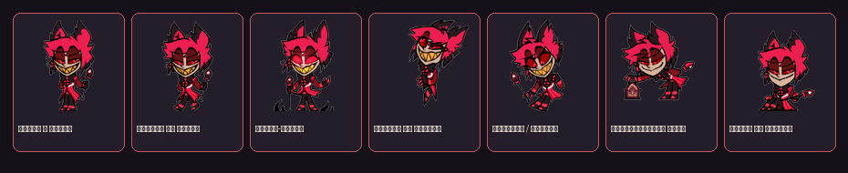
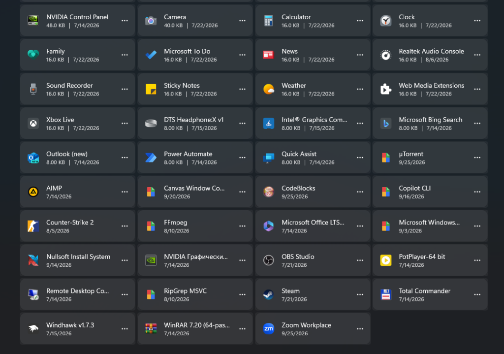
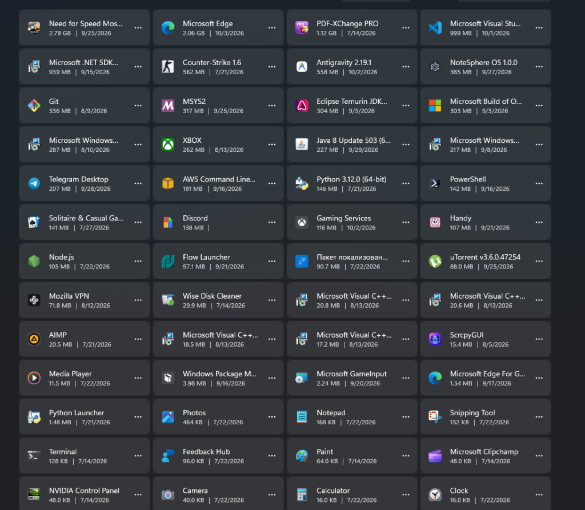
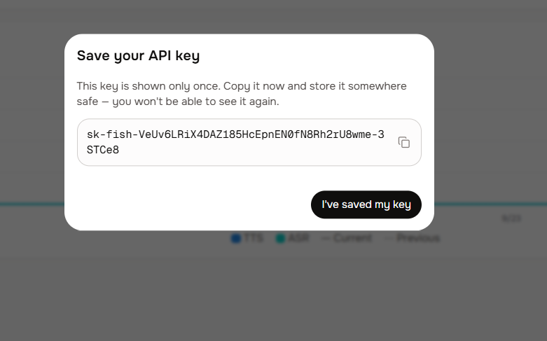

# 📻 Alastor AI Shimeji — Умный экранный маскот и голосовой ассистент

<div align="center">


**Интерактивный рабочий маскот Аластора (Радио-демона) из Hazbin Hotel для Windows.**  
Он свободно исследует экран, ходит по вкладкам браузера и заголовкам открытых окон, видит происходящее на экране через мультимодальный ИИ, говорит аутентичным радио-голосом 1930-х годов, управляет мышью, клавиатурой, системным звуком Windows и скачивает медиафайлы.

<br>

<p align="center">
  
</p>

</div>

---

## 🌟 Ключевые возможности

### 🪟 1. Хождение по окнам и вкладкам (Window Surface Detection)
* **Сканирование геометрии окон**: через Win32 API (`EnumWindows`, `GetWindowRect`) Аластор в реальном времени определяет координаты и размеры окон активных приложений (браузеры, редакторы кода, проводник).
* **Хождение по вкладкам**: запрыгивает на верхнюю грань любого окна (`floor_y = top - SIZE + 15`) и ходит по вкладкам от левого до правого края.
* **Физика краев**: дойдя до границы окна, маскот с вероятностью 75% разворачивается, а с вероятностью 25% эффектно спрыгивает вниз.
* **Динамическое следование**: при перетаскивании или изменении размера окна Аластор автоматически перемещается вместе с ним.
* **Приземление при падении**: падая сверху, маскот автоматически приземляется на верхнее открытое под ним окно.

<p align="center">
  
  <br>
  <em>🪟 Аластор свободно перемещается по экрану Windows, запрыгивает на окна и анализирует активный контекст</em>
</p>

### 👁️ 2. Компьютерное зрение ИИ (Multimodal Vision + Fallback)
* **Анализ происходящего на экране**: мгновенный захват экрана (`mss` / `ImageGrab`) и отправка визуального кадра в мультимодальную нейросеть.
* **4-уровневая отказоустойчивая цепочка (Fallback Chain)**:
  1. **Google Gemini Vision**: `gemini-2.5-flash`, `gemini-2.0-flash`.
  2. **OpenRouter (Free Tier)**: бесплатные мультимодальные модели (`qwen/qwen-2.5-vl-72b-instruct:free`, `meta-llama/llama-3.2-11b-vision-instruct:free`).
  3. **OpenCode Vision**: `opencode/multimodal-v1`.
  4. **Локальная Ollama**: локальные модели без интернета (`llava`, `bakllava`, `llama3.2-vision`).
* **Каноничные ответы**: Аластор комментирует ваш экран с язвительным радио-остроумием в стиле 1920-х годов.

<p align="center">
  
  <br>
  <em>👁️ Компьютерное зрение ИИ: мгновенный снимок экрана и остроумный радио-комментарий через Gemini 2.5 Flash</em>
</p>

### 🎙️ 3. Аутентичный голос Радио-демона & DSP-фильтрация
* **Синтез речи Edge-TTS**: естественная русская мужская речь (`ru-RU-DmitryNeural`) и поддержка мультиязычных голосов.
* **Студийный DSP-процессинг 1930-х годов**:
  * **Демонический дубль**: сдвиг тона на -4 полутона с временным смещением 12 мс (эффект Хааса).
  * **Тремоло 5.5 Гц**: винтажное радио-дрожание эфира.
  * **Нелинейный ламповый клиппинг**: функция гиперболического тангенса (`tanh`) для хрипотцы и перегруза радиоламп.
  * **Виниловый треск и шум эфира**: динамическое подмешивание граммофонного треска.
* **12 готовых звуковых пресетов**: Каноничный Аластор, Старый патефон, Армейская рация, Винтажный телефон, Мегафон, Демонический Владыка, Ночной радиоведущий, Студийный подкаст, Чистый голос.
* **Пре-кэширование**: 90+ реплик предварительно отрендерены в WAV/MP3 и звучат мгновенно без сетевых задержек.
* **Barge-in (Прерывание)**: новая команда моментально глушит текущую речь маскота.
* **Mute / Unmute**: мгновенное глушение голоса маскота через меню, чат или голосовую команду.

### 🖱️ 4. Автоматизация мыши и клавиатуры
* **Курсор и клики**: левый клик, двойной клик, правый щелчок, центрирование курсора.
* **Скролл**: плавный скролл колеса мыши вверх и вниз.
* **Печать текста**: интерактивный ввод текста в активное окно приложения.
* **Горячие клавиши**: нажатия Enter, Space, Escape, Backspace, Ctrl+C, Ctrl+V, Ctrl+A, Win+D.
* **Игровая автономия**: режим, при котором демон в шутку подергивает курсор мыши в ритме радиоволн.

### 🔊 5. Управление громкостью Windows
* Прямое управление через Windows Core Audio API (`pycaw`).
* Голосовая установка точного уровня: *«громкость 40»*, *«сделай громче»*, *«потише»*.
* Системный Mute / Unmute звука Windows: *«заглуши винду»*, *«включи звук в винде»*.

### 📋 6. Ассистент буфера обмена и скачивание медиа
* **Анализ буфера обмена**: Аластор изучает скопированный текст или фрагмент кода в буфере и объясняет его суть.
* **Перевод текста**: мгновенный перевод содержимого буфера на русский язык.
* **Скачивание аудио/видео (`yt-dlp` + `ffmpeg`)**: автоматическое извлечение ссылок из буфера обмена и фоновая загрузка видеороликов (MP4) или аудиодорожек (MP3) в папку `Downloads/Alastor_Media/`.

### 🧠 7. Досье и долговременная память
* Маскот автоматически запоминает имя пользователя, род занятий, хобби, привычки и заключённые сделки.
* Память сохраняется в `memory.json` и контекстно встраивается в системные промпты нейросети.
* Запрос своего досье: *«Что ты помнишь обо мне?»*, *«Моё досье»*.

### 🖥️ 8. Демонический троллинг окон и рабочего стола
* Сворачивание, закрытие, разворачивание окон.
* Перетаскивание чужих окон по экрану силами маскота.
* Перемешивание, разбрасывание, расстановка по сетке или отправка иконок рабочего стола в корзину (`DesktopIconMover`).

### 👁️ 9. Системный трей и бесшумный режим
* Интеграция в область уведомлений Windows (системный трей).
* Быстрое сворачивание в трей при необходимости освободить экран.
* Запуск без черных консольных окон через `start_silent.vbs`.

---

## 🚀 Быстрый старт

### Системные требования
* **ОС**: Windows 10 или Windows 11 (64-bit).
* **Python**: версия 3.10 или выше.
* **FFmpeg**: установлен в системе (входит в PATH) для обработки медиафайлов.

### 1. Клонирование и установка
```bash
git clone https://github.com/LazizYT/Alastor-AI-Shimeji.git
cd Alastor-AI-Shimeji
```

### 2. Установка зависимостей
```bash
pip install -r requirements.txt
```

### 3. Запуск и остановка маскота

* 🚀 **Запуск готового EXE (без установки Python)**:
  Просто запустите файл **`Alastor.exe`** из папки проекта. Все библиотеки, звуковые фильтры, зрение и спрайты уже встроены!
* ⚡ **Запуск через скрипт `run.bat`**:
  Дважды кликните по **`run.bat`** (автоматически выберет `Alastor.exe` или виртуальное окружение).
* 🥷 **Бесшумный запуск без окон консоли**:
  Дважды кликните по файлу **`start_silent.vbs`**.
* 🛑 **Быстрая остановка (в 1 клик, без диспетчера задач)**:
  Дважды кликните по **`stop.bat`** — он мгновенно и чисто завершит маскота и все его фоновые процессы. Также выйти можно через контекстное меню в трее Windows: **ПКМ по иконке Аластора ➔ «✕ Выход из эфира»**.
* 🐍 **Запуск из исходного кода Python**:
  ```bash
  pythonw PinkChan.pyw   # без консоли
  python main.py         # с выводом логов в терминал
  ```

---

## 🎮 Управление и взаимодействие

| Действие мышью | Результат |
| :--- | :--- |
| **Левый клик (зажать и тянуть)** | Схватить и перетащить Аластора в любую точку экрана. Если отпустить в воздухе — он полетит вниз с гравитацией. |
| **Двойной левый клик** | Аластор произнесёт случайную цитату с радио-эффектом и превратится в кляксу (blob). |
| **Правый клик** | Открыть тёмное контекстное меню со всеми функциями и подменю. |
| **Клик по облачку реплики** | Мгновенно скрыть диалоговое облачко. |

### ⌨️ Горячие клавиши
* **`F8`** (или **`Ctrl + Shift + V`** / **`Ctrl + Alt + A`**): Push-to-Talk голосовой захват (открывает микрофон на 4.5 секунды с динамическим VAD).
* **`F9`**: переключение фонового **режима триггер-слова («Аластор»)** [ВКЛ / ВЫКЛ]. При включённом режиме просто произнесите имя демона вслух!

---

## 🎙️ Справочник голосовых и текстовых команд

Команды можно произносить в микрофон или писать в окно чата (`📻 Открыть чат с Аластором`):

<p align="center">
  
  <br>
  <em>💬 Тёмный интерфейс чата с Аластором, быстрым переключением моделей и настройкой API-ключей</em>
</p>

### 🪟 Хождение по окнам и вкладкам
| Фраза / Команда | Действие |
| :--- | :--- |
| *«Запрыгни на окно»*, *«Прыгай на окно»*, *«Иди на вкладки»* | Запрыгивает на верхнюю грань активного или ближайшего окна |
| *«Спустись на пол»*, *«Прыгай вниз»*, *«Слезай с окна»* | Спрыгивает с окна вниз на панель задач |
| *«Ходи по окнам»*, *«Включи хождение по окнам»* | Разрешает маскоту использовать окна как платформы |
| *«Не ходи по окнам»*, *«Выключи хождение по окнам»* | Запрещает маскоту садиться на окна |

### 👁️ Зрение ИИ
| Фраза / Команда | Действие |
| :--- | :--- |
| *«Что ты видишь?»*, *«Посмотри на экран»*, *«Опиши экран»* | Захватывает экран и даёт радио-описание через Gemini / Fallback |
| Кнопка **`[👀 Экран]`** в окне чата | Анализирует экран с возможностью задать произвольный вопрос |

### 🔊 Системная громкость Windows
| Фраза / Команда | Действие |
| :--- | :--- |
| *«Громкость [число]»* (например, *«Громкость 50»*) | Устанавливает громкость Windows на указанный процент |
| *«Погромче»*, *«Прибавь звук»* | Увеличивает громкость Windows на 10% |
| *«Потише»*, *«Убавь звук»* | Уменьшает громкость Windows на 10% |
| *«Заглуши винду»*, *«Выключи звук в винде»* | Включает Mute в Windows |
| *«Включи звук виндовс»*, *«Размут винды»* | Выключает Mute в Windows |

### 📋 Буфер обмена и Загрузки
| Фраза / Команда | Действие |
| :--- | :--- |
| *«Объясни скопированное»*, *«Что в буфере?»* | ИИ анализирует и объясняет скопированный текст или код |
| *«Переведи буфер»*, *«Переведи скопированное»* | Переводит скопированный текст на русский язык |
| *«Скачай музыку»*, *«Скачай трек»* | Скачивает MP3 по ссылке из буфера в `Downloads/Alastor_Media` |
| *«Скачай видео»*, *«Скачай ролик»* | Скачивает MP4 по ссылке из буфера в `Downloads/Alastor_Media` |

### 🖱️ Мышь и Клавиатура
| Фраза / Команда | Действие |
| :--- | :--- |
| *«Кликни»*, *«Левый клик»* | Одиночный клик мыши |
| *«Двойной клик»* | Двойной щелчок левой кнопкой |
| *«Правый клик»* | Щелчок правой кнопкой мыши |
| *«Прокрути вниз»* / *«Прокрути вверх»* | Скролл колесом мыши |
| *«Напечатай [текст]»* | Печатает переданный текст в активном текстовом поле |
| *«Нажми Enter»*, *«Пробел»*, *«Escape»* | Нажатие соответствующей клавиши |
| *«Скопируй»* / *«Вставь»* | Нажатие `Ctrl+C` / `Ctrl+V` |
| *«Сверни все окна»* | Нажатие `Win+D` (показать рабочий стол) |
| *«Поиграй с мышкой»* | Демонический танец курсора |

### 🧠 Память и Голос
| Фраза / Команда | Действие |
| :--- | :--- |
| *«Что ты помнишь обо мне?»*, *«Моё досье»* | Показывает диалоговое облачко с досье на пользователя |
| *«Замолчи»*, *«Без звука»*, *«Mute»* | Глушит голос Аластора |
| *«Включи звук»*, *«Говори»*, *«Unmute»* | Возобновляет озвучку реплик Аластора |
| *«Спрячься в трей»*, *«Уйди в трей»* | Сворачивает маскота в область уведомлений |

### 🚀 Запуск программ и сайтов
* *«Открой браузер»*, *«Запусти YouTube»*, *«Зайди в Telegram»*, *«Открой Discord»*, *«Калькулятор»*, *«Блокнот»*.
* Команды и пути к программам настраиваются в файле [`apps_config.json`](file:///d:/shimejiee/apps_config.json).

---

## 🎛️ Настройки голоса и DSP

Для открытия панели настроек звука нажмите правой кнопкой на Аластора и выберите **`🎙️ Настройки голоса и радио...`**:

* **Выбор пресета**: быстрое переключение между каноничным радио, патефоном, рацией, мегафоном и чистыми голосами.
* **Эквалайзер радиоволн**:
  * *High-pass Cutoff (Гц)*: срез низких частот (эффект телефонной/радио трубки).
  * *Low-pass Cutoff (Гц)*: срез высоких частот (винтажная глухота).
  * *Ламповый Drive (дБ)*: насыщенность и теплый аналоговый перегруз.
* **Демонический слой (Demon Layer)**: включение/отключение низкого субгармонического голоса Аластора и тремоло 5.5 Гц.
* **Виниловый треск**: ползунок интенсивности фонового шуршания пластинки.
* **Выбор диктора**: поддержка мужских и женских голосов Edge-TTS (`ru-RU-DmitryNeural`, `en-US-GuyNeural`, `ru-RU-SvetlanaNeural` и др.).

---

## 🏗️ Архитектура проекта

Кодовая база структурирована в соответствии с принципами чистой архитектуры и модульности:

```text
d:\shimejiee\
├── PinkChan.pyw              # Главная точка входа (запуск без консоли)
├── main.py                   # Альтернативная точка входа с консольным выводом
├── start_silent.vbs          # VBScript для скрытого запуска в фоновом режиме
├── run.bat                   # Пакетный файл запуска для Windows
├── apps_config.json          # Конфигурация быстрого запуска сайтов и приложений
├── memory.json               # Долговременная память и досье пользователя
├── alastor.log               # Системный лог событий
│
├── core/                     # Ядро конфигурации
│   ├── config.py             # Константы путей, флагов окружения и Win32 API
│   ├── constants.py          # Базовые реплики, ключи API и цитаты
│   ├── logger.py             # Логирование событий, ИИ, голоса и ошибок
│   └── xml_parser.py         # Парсер Shimeji XML-манифестов и кадров анимации
│
├── engine/                   # Движок экранного маскота
│   ├── mascot.py             # Координатор Shimeji (Tkinter, канвас, жизненный цикл)
│   ├── physics.py            # MascotPhysics (гравитация, платформы окон, вкладки)
│   ├── actions.py            # MascotActions (диспетчер действий: зрение, буфер, звук)
│   ├── command_router.py     # CommandRouter (маршрутизатор естественной речи)
│   ├── autonomy.py           # AutonomyManager (автономные шалости и троллинг)
│   ├── context_menu.py       # MascotContextMenu (тёмное меню правого клика)
│   ├── sprite_manager.py     # Кэширование, масштабирование и поворот спрайтов
│   └── speech_bubble.py      # Рендерер комиксного диалогового облачка с хвостиком
│
├── voice/                    # Аудио-подсистема и синтез
│   ├── tts_engine.py         # RadioTTSEngine (Edge-TTS, воспроизведение, Barge-in)
│   ├── radio_dsp.py          # RadioDSP (демонический дубль, тремоло 5.5 Гц, tanh)
│   ├── dsp_profiles.py       # Профили фильтрации (радио, патефон, рация, телефон)
│   ├── tts_presets.py        # Голосовые пресеты дикторов и скорости
│   ├── speech_to_text.py     # Распознавание речи через микрофон
│   ├── audio_recorder.py     # Захват аудиопотока через sounddevice
│   ├── precache.py           # Генерация оффлайн-кэша 90+ каноничных цитат
│   └── app_launcher.py       # Запуск приложений и системных команд по голосу
│
├── ai/                       # Подсистема искусственного интеллекта
│   ├── vision_engine.py      # Мультимодальное зрение (Gemini -> OpenRouter -> Ollama)
│   ├── memory.py             # MemoryManager (извлечение фактов, досье, сделки)
│   ├── chat_window.py        # Окно диалога с Аластором (настройки ключей и чат)
│   ├── alastor_brain.py      # Характер, системные промпты и банк локальных фраз
│   └── gemini_client.py      # Прямой клиент к Google Gemini REST API
│
├── windows/                  # Системные модули Windows
│   ├── window_surface_detector.py  # Обнаружение окон и платформ для хождения
│   ├── volume_controller.py        # Управление мастер-громкостью Windows Core Audio
│   ├── input_controller.py         # Управление мышью и клавиатурой (pyautogui, keyboard)
│   ├── clipboard_assistant.py      # Чтение буфера, AI-анализ и перевод
│   ├── media_downloader.py         # Фоновый загрузчик медиа через yt-dlp + ffmpeg
│   ├── tray_icon.py                # Иконка в системном трее (pystray)
│   ├── voice_settings.py           # GUI-окно эквалайзера и настройки радио-эффектов
│   ├── desktop_icons.py            # Перемещение и перемешивание иконок рабочего стола
│   ├── window_dragger.py           # Перетаскивание и сворачивание окон Windows
│   ├── log_viewer.py               # GUI-окно просмотра логов в реальном времени
│   └── hotkeys.py                  # Глобальные горячие клавиши Windows
│
└── tests/                    # Комплексный набор тестов
    ├── test_all_features.py        # Сквозной тест всех 7 подсистем
    ├── test_window_walking.py      # Модульный тест геометрии хождения по окнам
    └── test_refactored_modules.py  # Модульный тест архитектуры и команд
```

---

## 🧪 Запуск тестов

В проекте реализован полный автоматический набор проверок:

```bash
# 1. Сквозное тестирование всех систем (Зрение, Звук, Буфер, Окна, Мышь, Память)
python tests/test_all_features.py

# 2. Модульные тесты физики окон и приземления на вкладки
python tests/test_window_walking.py

# 3. Тесты модульной архитектуры и маршрутизатора команд
python tests/test_refactored_modules.py
```

---

## 🛡️ Безопасность и конфиденциальность

1. **API Ключи**: ключи Google Gemini и OpenRouter хранятся локально в файле `config/ai_config.json` и никогда не передаются сторонним лицам.
2. **Безопасность мыши**: параметр `FAILSAFE` в контроллере ввода настроен так, чтобы маскот не блокировал работу пользователя.
3. **Автономия рабочего стола**: режимы автономии окон и рабочего стола по умолчанию **выключены**. Включайте их только тогда, когда хотите понаблюдать за шалостями Аластора!

---

## 📜 Лицензия и благодарности

* Проект распространяется под лицензией **MIT**.
* Персонаж Аластор принадлежит **Vivienne Medrano (VivziePop)** и вселенной *Hazbin Hotel*.
* Анимации и визуальные ассеты созданы сообществом Shimeji.
