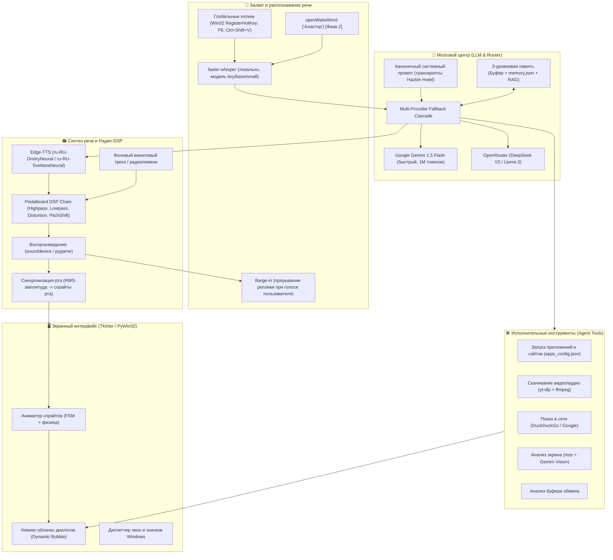

# 🎙️ Alastor Desktop AI Companion (Shimeji Voice Assistant)

Интерактивный экранный маскот-помощник в образе **Аластора (Радио-демона из Hazbin Hotel)**, гуляющий по рабочему столу Windows, обладающий аутентичным радио-голосом 1930-х годов, распознающий русскую речь, управляющий приложениями и системой, а также общающийся с пользователем через современные языковые модели (LLM).

---

## 🏛️ 1. Архитектура системы



---

## 🧩 2. Ключевые модули и технический стек

### 2.1. Экранный маскот и анимация (`PinkChan.pyw`)
- **Язык & GUI:** Python 3.11+, Tkinter с прозрачным окном (`-transparentcolor`, `-topmost`, без рамок).
- **Физика & FSM:** Конечный автомат состояний (`standing`, `walking`, `guitar`, `blob`, `ghost`, `box`, `kneel`, `falling`, `climbing`).
- **Коррекция ориентации спрайтов:** Зеркалирование относительно направления движения (устранена "лунная походка").
- **Кастомный баббл речи:** Отрисовка винтажного комикс-облачка через Pillow с хвостиком, указывающим на голову Аластора.
- **Интеграция с Windows:** Использование `pywin32` / `ctypes` для перемещения окон, управления громкостью, взаимодействия с рабочим столом.

### 2.2. Захват аудио и хоткеи
- **Глобальные горячие клавиши:**
  - Реализованы через нативный Win32 API `RegisterHotKey` в выделенном фоновом потоке с циклом `GetMessageW`.
  - **Клавиши:** `F8` (быстрый вызов в 1 клавишу), `Ctrl+Shift+V` и `Ctrl+Alt+A`.
  - **Полная независимость от раскладки:** работает как в русской (RU), так и в английской (EN) раскладках без сбоев.
- **Распознавание речи (STT):**
  - Быстрое распознавание русской речи через `faster-whisper` (модель `small` или `base` на GPU/CPU).

### 2.3. Радио-демон DSP пайплайн (Звуковой эффект 1930-х)
Для создания аутентичного голоса Аластора используется связка бесплатного Edge-TTS и аудио-фильтров:
1. **Edge-TTS:** Генерация базового мужского дикторского голоса (`ru-RU-DmitryNeural`).
2. **DSP-обработка (Spotify `pedalboard`):**
   - **Highpass Filter:** срез ниже 350 Гц (убирает современный басовый низ).
   - **Lowpass Filter:** срез выше 3800 Гц (эффект узкой полосы АМ-радиоприемника).
   - **Distortion / Saturation:** сатурация +8 dB (теплый ламповый перегруз).
   - **PitchShift:** небольшое повышение тона (+1.2 полутона для экспрессивности).
   - **Vinyl/Radio Crackle:** наложение тихого зацикленного винилового шума с треском.

### 2.4. Интеллект и каноничный характер Аластора
- **Системный промпт:** Содержит характер, цитаты, речевые паттерны (учтивый винтажный джентльмен 1930-х, радиоведущий, легкая ирония, театральность, отвращение к современным глупостям, интерес к сделкам).
- **Каскадный роутер LLM:**
  - 1-й приоритет: **Google Gemini 1.5 Flash** (быстро, огромный контекст, бесплатно в Google AI Studio).
  - 2-й приоритет: **OpenRouter** (доступ к DeepSeek V3, Llama 3).
  - 3-й приоритет: Локальная модель или заготовленные остроумные реплики при отсутствии интернета.
- **Память:**
  - Краткосрочная (последние 10-15 реплик диалога).
  - Долгосрочная (`memory.json` — имя пользователя, любимые приложения, привычки).

### 2.5. Набор инструментов (Tool Calling)
- **Быстрый запуск:** `apps_config.json` с поддержкой синонимов (YouTube, Telegram, Discord, игры, калькулятор, папки).
- **Скачивание медиа:** Интеграция `yt-dlp` для загрузки аудио/видео по ссылке из буфера или голосом.
- **Зрение (Vision):** Скриншот экрана через `mss` и передача в Gemini Vision для вопросов "Что у меня на экране?", "Помоги с этой ошибкой".
- **Управление системой:** Регулировка громкости (`pycaw`), сворачивание окон, поиск в сети.

---

## 🗺️ 3. Поэтапный план реализации (Roadmap)

### ✅ Фаза 1: Стабильная база и управление (Выполнено)
- [x] Анализ исходного проекта Shimeji и перевод с испанского на русский язык.
- [x] Замена спрайтов на Аластора (папка `794`).
- [x] Устранение фоновых помех/артефактов в окне маскота.
- [x] Исправление реверса движения ("лунной походки") при ходьбе налево/направо.
- [x] Генерация динамического винтажного комикс-облачка с хвостиком.
- [x] Поддержка голосового распознавания (`faster-whisper` / `sounddevice`).
- [x] Конфигуратор приложений `apps_config.json` (голосовой запуск сайтов и программ).
- [x] **Исправление горячих клавиш:** нативный Win32 API `RegisterHotKey` (поддержка `F8`, `Ctrl+Shift+V`, `Ctrl+Alt+A` в RU/EN раскладках).
- [x] **Создание резервной копии:** проект упакован в `d:\shimejiee_backup.zip`.
- [x] **Модульный рефакторинг архитектуры:** монолит в 2200+ строк разделен на чистые пакеты (`core/`, `windows/`, `ai/`, `voice/`, `engine/`).

---

### ✅ Фаза 2: Радио-голос и звуковые эффекты Аластора (Выполнено)
- [x] Интеграция библиотеки `edge-tts` для генерации русского голоса (`ru-RU-DmitryNeural`).
- [x] Создание аудио-пайплайна `radio_dsp.py` на базе `pedalboard` (фильтры частот 350-3800Hz + ламповая сатурация + виниловый треск).
- [x] Озвучивание случайных реплик при клике, ходьбе, голосовых командах и ответах ИИ.
- [x] Реализация Barge-in (мгновенная остановка воспроизведения голоса при начале речи пользователя или хоткее).
- [x] **Подсистема логирования и окно просмотра логов:** модуль `core/logger.py` и графический просмотрщик `windows/log_viewer.py` в контекстном меню маскота.

---

### 🧠 Фаза 3: Продвинутый ИИ-мозг и каноничная личность (Следующий шаг)
- [ ] Внедрение каскадного роутера провайдеров (Gemini 1.5 Flash ↔ OpenRouter).
- [ ] Расширение системного промпта цитатами из транскриптов Hazbin Hotel.
- [ ] Создание системы памяти (`memory.json`) для сохранения фактов о пользователе и его предпочтений.
- [ ] Поддержка потокового ответа (стриминг текста в облачко по мере генерации).

---

### 👁️ Фаза 4: Глаза, рот и расширенная анимация
- [ ] Разделение лицевых слоев (глаза, рот, тело) для интерактивности:
  - Глаза следят за курсором мыши через расчет угла `atan2`.
  - Рот анимируется синхронно с громкостью генерируемого голоса (RMS-анализ аудиопотока).
- [ ] Эффект сжатия и растяжения (squash & stretch) при приземлении и прыжках.

---

### ✅ Фаза 5: Автономные ассистент-инструменты (Выполнено)
- [x] **Мультимодальное зрение (`ai/vision_engine.py`):** захват экрана + отказоустойчивая цепочка Fallback (Gemini → OpenRouter Free → OpenCode → Ollama).
- [x] **Медиа-загрузчик (`windows/media_downloader.py`):** скачивание музыки (MP3) и видео (MP4) через `yt-dlp` + `ffmpeg` в папку `Downloads/Alastor_Media/`.
- [x] **Буферный ассистент (`windows/clipboard_assistant.py`):** анализ, объяснение кода/ошибок и перевод текста из буфера обмена в радио-стиле Аластора.
- [x] **Управление громкостью Windows (`windows/volume_controller.py`):** регулировка громкости и заглушение через Core Audio API (`pycaw`).
- [x] **Управление мышью и клавиатурой (`windows/input_controller.py`):** клики, скролл, ввод текста, хоткеи.

---

### 📦 Фаза 6: Упаковка и сборка автономного дистрибутива
- [ ] Сборка через PyInstaller / Nuitka в единый исполняемый файл `.exe`.
- [ ] Подготовка инсталлятора / мастера первоначальной настройки (ввод API ключа, выбор микрофона).

---

## ⚙️ 4. Структура проекта (Модульная архитектура)

```text
d:\shimejiee/
├── PinkChan.pyw              # Главный графический лаунчер маскота
├── main.py                   # Консольная точка входа (python main.py)
├── apps_config.json          # Конфигурация голосового запуска программ и сайтов
├── alastor.log               # Системный журнал событий и радиоволн
├── Actions.xml               # XML-схема анимаций и действий
├── Behaviors.xml             # XML-схема поведения
├── project.md                # Архитектура и дорожная карта проекта
├── user_tasks.md             # Чеклист задач пользователя (ключи API, настройки)
├── requirements.txt          # Список зависимостей Python
│
├── core/                     # Ядро конфигурации, логирования и парсинга
│   ├── __init__.py
│   ├── config.py             # Пути, размеры экрана, доступность библиотек
│   ├── constants.py          # Банк реплик Аластора (SPEECHES, POKED_SPEECHES)
│   ├── logger.py             # Кольцевой буфер и ротация системного журнала
│   └── xml_parser.py         # Парсер Actions.xml и маппинг кадров анимации
│
├── windows/                  # Системная интеграция с Windows (Win32)
│   ├── __init__.py
│   ├── hotkeys.py            # Потоковый Win32 RegisterHotKey (F8, Ctrl+Shift+V)
│   ├── window_dragger.py     # Захват, перетаскивание, сворачивание окон
│   ├── desktop_icons.py      # Манипуляция значками рабочего стола Windows
│   └── log_viewer.py         # Графический интерфейс просмотра системных логов
│
├── ai/                       # Искусственный интеллект и чат
│   ├── __init__.py
│   ├── alastor_brain.py      # Системный каноничный промпт и эвристический генератор
│   ├── gemini_client.py      # Клиент Google Gemini 1.5/2.0/2.5 Flash API
│   └── chat_window.py        # Графическое окно радио-чата (Tkinter / Catppuccin)
│
├── voice/                    # Захват голоса, синтез речи и радио-DSP
│   ├── __init__.py
│   ├── audio_recorder.py     # Запись аудио через sounddevice
│   ├── speech_to_text.py     # Распознавание речи (faster-whisper / Google STT)
│   ├── radio_dsp.py          # Фильтры 1930-х (Spotify pedalboard / scipy + винил)
│   ├── tts_engine.py         # Синтез речи Edge-TTS + кеширование + Barge-in
│   └── app_launcher.py       # Парсер голосовых команд, запуск приложений и сайтов
│
├── engine/                   # Движок экранного маскота
│   ├── __init__.py
│   ├── mascot.py             # Главный класс Shimeji (FSM, физика, цикл тиков, меню)
│   ├── sprite_manager.py     # Загрузка, кеширование и трансформация спрайтов
│   └── speech_bubble.py      # Отрисовка комикс-облачка с динамическим хвостиком
│
└── img/                      # Спрайты персонажа
    ├── 794/                  # Текущий набор спрайтов Аластора (shime1..shime46)
    └── Shimeji/              # Запасной классический набор
```
